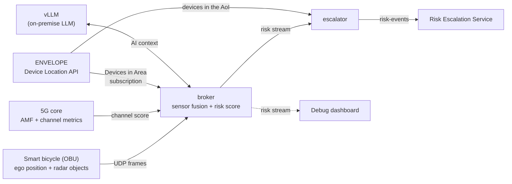

# GUARD-TWIN Edge

Edge services of **GUARD-TWIN**, the ENVELOPE project on the
safety of **Vulnerable Road Users** (VRUs): pedestrians, cyclists and
micromobility riders.

## The project in brief

Most VRUs carry no V2X-capable device, so cooperative safety systems cannot
see them. GUARD-TWIN addresses this with a **hybrid** approach:

- **Passive sensing on the move.** A smart bicycle, equipped with a V2X
  On-Board Unit and perception sensors, acts as a mobile sensing node. It
  detects the road users around it (cars, people, bikes…) whether or not they
  are connected, and streams what it sees to the edge.
- **Network-side awareness.** The ENVELOPE **Device Location API**
  (*Devices in Area*) tells which connected devices are inside an **Area of
  Interest** (AoI), such as an intersection, a crossing or a school zone.
- **An edge digital twin.** These sources are fused in real time at the edge
  of the 5G network into a **risk level** for the area. When the risk level
  changes, it is escalated so that the devices in the AoI can be warned and
  the network can react.

The project is validated at the Italian ENVELOPE test site in Turin. Partners
are Politecnico di Milano, UNIMORE, SMA-RTY, Dropper and INSOFTDEV.

## What this repository contains

This repository implements the edge part of the architecture: the
*Real Time Sensor Fusion* and *Real Time Risk Level Detector* blocks of the
proposal, their link to the ENVELOPE Device Location API, and the escalation
of risk events.



| Component | Role |
|---|---|
| [`startup.py`](startup.py) | Container entry point, in three phases: (1) checks ENVELOPE health and subscribes to *Devices in Area* for the AoI; (2) waits for the first frame from the bike (optional); (3) runs the broker. On stop it removes its subscription, and at start it clears leftovers from earlier runs. |
| [`broker.py`](broker.py) | The sensor fusion. It receives the bike's frames (its position and the objects its radar detects), polls the channel quality of the bike's link from the 5G core, combines both with the AI Context Score, and publishes one risk record per frame as an NDJSON stream. |
| [`ai_assess.py`](ai_assess.py) | The **AI Context Score**. An LLM, served locally by vLLM, reads the map around the bike (buildings, streets, crossings, tram tracks…) together with the local date and time, and reports the hazards the place creates, such as blind corners, junctions, busy crossings or poor surfaces. The code scores those hazards; the model only detects and explains them. |
| [`escalator.py`](escalator.py) | Follows the risk stream. Whenever the risk level changes, it sends a *risk-event* to the Risk Escalation Service for the devices currently in the AoI, as returned by the Device Location API. |
| [`envelope_location.py`](envelope_location.py) | Client for the ENVELOPE Device Location API (health, subscriptions, callbacks, area queries). |
| [`dashboard/`](dashboard/) | Debug dashboard. It shows a map of the AoI, the bike, the radar objects and the LLM hazards, the live risk score and its components, the devices in the area, and the logs of each service. It is also where the AoI and the main settings are edited. |
| [`tools/`](tools/) | Utilities: fetching the site geometry from OpenStreetMap, replaying recorded field data, and a simulated ride (`sim_ride.py`) that feeds synthetic data into the running stack. |
| [`files/`](files/) | Static site data: `geometry.geojson`, the map of the test site used by the AI Context Score. |

## How the risk level is determined (overview)

Each frame from the bike produces a risk score from 0 to 10, which maps to a
level from *none* to *critical*. The score is the sum of three contributions:

- **Deterministic Score** (0–10): the risk from the objects the radar
  detects. It depends on time-to-collision, distance, the kind of object
  (truck, car, person…) and whether it is heading towards the bike.
- **Channel Penalty** (0–3 by default): when the bike's 5G link is degraded,
  the radar risk counts for more, because warnings may not arrive in time. A
  poor link never creates risk on its own.
- **AI Context Score** (0–2 by default): the risk created by the place and
  the moment, as assessed by the LLM. For example, a crossing hidden by a
  building, or a school entrance at 07:55 on a school day. It is kept small,
  so the environment alone cannot raise an alarm.

The detailed logic (formulas, weights, thresholds, and when an LLM result is
still valid) is described in [`DATA_MODEL.md`](DATA_MODEL.md).

## ENVELOPE APIs

- **Device Location: Devices in Area.** Used through a subscription (callbacks
  when devices enter the AoI) and through area queries (the devices to attach
  to each risk event).
- **Quality on Demand** and **Edge Cloud** are part of the GUARD-TWIN
  architecture, but are not called from this repository. Risk events are
  handed to the Risk Escalation Service.

## Running it

Requirements: Docker with the compose plugin and an NVIDIA GPU for vLLM.
The compose file defines three services:

| Service | What it runs | Ports on the host |
|---|---|---|
| `broker` | `startup.py`, then `broker.py` | 30491/udp (bike frames), 30500/tcp (risk stream), 8081/tcp (ENVELOPE callbacks) |
| `escalator` | `escalator.py` | none |
| `vllm` | the LLM server (Gemma 4 12B, quantized) | 8000/tcp |

```bash
docker compose up -d --build          # start (or update) the stack
python3 dashboard/dashboard.py        # debug dashboard on http://127.0.0.1:8095
```

The dashboard listens on localhost only; open it through port forwarding
(for example the VS Code *Ports* tab).

**Configuration** is done through compose variables, written in a `.env` file
next to `docker-compose.yml`. Usually you edit them from the dashboard's
*Settings* tab, which writes `.env` and restarts broker and escalator. The
main ones:

| Variable | Meaning |
|---|---|
| `AOI_LAT`, `AOI_LON`, `AOI_RADIUS` | the Area of Interest |
| `IMSI` | the bike's IMSI, for the channel measurements |
| `RESOLVER_URL`, `METRICS_URL` | the 5G core: AMF and channel-metrics server |
| `AI_CONTEXT_MAX`, `CHAN_PENALTY_MAX` | the maximum contribution of the AI Context Score and of the Channel Penalty |
| `LLM_DISABLE`, `LLM_CLOCK` | turn off the AI Context Score, or give the LLM a fixed date and time (for tests) |
| `RISK_ESCALATION_URL`, `AOI_ID`, `EVALUATOR_BEARER_TOKEN` | the Risk Escalation Service |

**Site geometry.** When the AoI moves to a new place, refresh the map used by
the AI Context Score:

```bash
python3 tools/fetch_geometry.py --lat <lat> --lon <lon> --radius-m 300
```

**Simulated ride.** To exercise the whole stack without the real bike or 5G
core:

```bash
python3 tools/sim_ride.py
```

This sends a synthetic ride inside the AoI, with moving objects and a scripted
channel. Everything downstream is real, including the risk events sent for
the devices actually in the AoI.

## Privacy

In line with the proposal's privacy-by-design commitments, the road users the
bike detects are reported only as anonymous objects (class, position and
motion). The only identifiers handled are the bike's own IMSI, used for its
channel measurements, and the device addresses the Device Location API returns
for the AoI, which are needed to address the risk events.

## Acknowledgement

ENVELOPE has received funding from the Smart Networks and Services Joint
Undertaking (SNS JU) under the European Union's Horizon Europe research and
innovation programme under Grant Agreement No 101139048.
