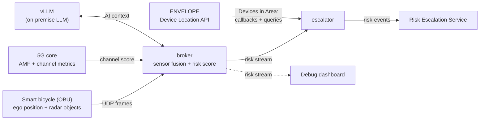

# GUARD-TWIN Edge

Edge services of **GUARD-TWIN**, the ENVELOPE project on the
safety of **Vulnerable Road Users** (VRUs): pedestrians, cyclists and
micromobility riders.

## The project in brief

Most VRUs carry no V2X-capable device, so cooperative safety systems cannot
see them. GUARD-TWIN addresses this with a **hybrid** approach:

- **Passive sensing on the move.** A smart bicycle, equipped with a V2X
  On-Board Unit and perception sensors, acts as a mobile sensing node. It
  detects the road users around it (cars, people, bikes…) whether or not they
  are connected, and streams what it sees to the edge.
- **Network-side awareness.** The ENVELOPE **Device Location API**
  (*Devices in Area*) tells which connected devices are inside an **Area of
  Interest** (AoI), such as an intersection, a crossing or a school zone.
- **An edge digital twin.** These sources are fused in real time at the edge
  of the 5G network into a **risk level** for the area. When the risk level
  changes, it is escalated so that the devices in the AoI can be warned and
  the network can react.

The project is validated at the Italian ENVELOPE test site in Turin. Partners
are Politecnico di Milano, Università di Modena e Reggio Emilia, SMA-RTY, Dropper.ai and INSOFTDEV.

## What this repository contains

This repository implements the edge part of the architecture: the
*Real Time Sensor Fusion* and *Real Time Risk Level Detector* blocks of the
proposal, their link to the ENVELOPE Device Location API, and the escalation
of risk events.



| Component | Role |
|---|---|
| [`startup.py`](startup.py) | Container entry point, in three phases: (1) checks ENVELOPE health; (2) waits for the first frame from the bike (optional); (3) runs the broker. |
| [`broker.py`](broker.py) | The sensor fusion. It receives the bike's frames (its position and the objects its radar detects), polls the channel quality of the bike's link from the 5G core, combines both with the AI Context Score, and publishes one risk record per frame as an NDJSON stream. |
| [`ai_assess.py`](ai_assess.py) | The **AI Context Score**. An LLM, served locally by vLLM, reads the map around the bike (buildings, streets, crossings, tram tracks…) together with the local date and time, and reports the hazards the place creates, such as blind corners, junctions, busy crossings or poor surfaces. The code scores those hazards; the model only detects and explains them. |
| [`escalator.py`](escalator.py) | Follows the risk stream. Whenever the risk level changes, it sends a *risk-event* to the Risk Escalation Service for the devices currently in the AoI. It keeps that list itself: a *Devices in Area* subscription adds devices as soon as they enter, a query every 5 s adds and removes them. Only the current subscription's callbacks count; leftover subscriptions from earlier runs are deleted (retried every minute). |
| [`envelope_location.py`](envelope_location.py) | Client for the ENVELOPE Device Location API (health, subscriptions, callbacks, area queries). |
| [`recorder.py`](recorder.py) | Records every input from outside (radar, 5G core, LLM, ENVELOPE, Risk Escalation) while the dashboard's Record button is on, for `tools/replay_recording.py`. |
| [`dashboard/`](dashboard/) | Debug dashboard. It shows a map of the AoI, the bike, the radar objects and the LLM hazards, the live risk score and its components, the devices in the area, and the logs of each service. It is also where the AoI and the main settings are edited. |
| [`tools/`](tools/) | Utilities: fetching the site geometry from OpenStreetMap, replaying recordings of real rides (`replay_recording.py`), and a simulated ride (`sim_ride.py`) that feeds synthetic data into the running stack. |
| [`files/`](files/) | Static site data: `geometry.geojson`, the map of the test site used by the AI Context Score. |

## How the risk level is determined (overview)

Each frame from the bike produces a risk score from 0 to 10, which maps to a
level from *none* to *critical*. The score is the sum of three contributions:

- **Deterministic Score** (0–10): the risk from the objects the radar
  detects. It depends on time-to-collision, distance, the kind of object
  (truck, car, person…) and whether it is heading towards the bike.
- **Channel Penalty** (0–2 by default): when the bike's 5G link is degraded,
  the radar risk counts for more, because warnings may not arrive in time. A
  poor link never creates risk on its own.
- **AI Context Score** (0–3 by default): the risk created by the place and
  the moment, as assessed by the LLM. For example, a crossing hidden by a
  building, or a school entrance at 07:55 on a school day. It is kept small,
  so the environment alone cannot raise an alarm.

The two maximums (2 and 3 points) are only defaults, not fixed parts of the
model: set them freely with `CHAN_PENALTY_MAX` and `AI_CONTEXT_MAX`, from
the dashboard's *Settings* tab or in `.env` (see [Running it](#running-it)).

The detailed logic (formulas, weights, thresholds, and when an LLM result is
still valid) is described in [`DATA_MODEL.md`](DATA_MODEL.md).

## ENVELOPE APIs

- **Device Location: Devices in Area.** Used by the escalator to keep the list
  of devices in the AoI: a subscription (callbacks when devices enter the AoI)
  and area queries every few seconds (which also notice when they leave, since
  there is no callback for that).
- **Quality on Demand** and **Edge Cloud** are part of the GUARD-TWIN
  architecture, but are not called from this repository. Risk events are
  handed to the Risk Escalation Service.

## Running it

Requirements: Docker with the compose plugin and an NVIDIA GPU for vLLM.
The compose file defines four services:

| Service | What it runs | Ports on the host |
|---|---|---|
| `broker` | `startup.py`, then `broker.py` | 30491/udp (bike frames), 30500/tcp (risk stream) |
| `escalator` | `escalator.py`: risk-events, and the list of devices in the AoI (ENVELOPE subscription + periodic query) | 8081/tcp (ENVELOPE callbacks) |
| `vllm` | the LLM server (Gemma 4 12B, quantized) | 8000/tcp |
| `dashboard` | `dashboard/dashboard.py`, the debug dashboard | 8095/tcp (`DASHBOARD_PORT`) |

```bash
docker compose up -d --build          # start (or update) the stack, dashboard included
```

The dashboard starts with the stack and listens on all interfaces, so any
machine on the local network can open it at `http://<server-ip>:8095`. This
is deliberate: the network is a private 5G network, and changing the settings
from the LAN is the point. For this the container gets the docker socket and
the repository mounted, since *Settings* writes `.env` and restarts broker and
escalator through compose. Its code comes from the mount, so after editing
it a `docker compose restart dashboard` is enough.

The dashboard accepts requests addressed by IP
or by this server's own host name; add other names with `--allow-host`, or
use `--host 127.0.0.1` to restrict it to localhost (then open it through port
forwarding, for example the VS Code *Ports* tab). It can also run by hand on
the host, outside compose: `python3 dashboard/dashboard.py`.

**Configuration** is done through compose variables, written in a `.env` file
next to `docker-compose.yml`. Usually you edit them from the dashboard's
*Settings* tab, which writes `.env` and restarts broker and escalator. The
main ones:

| Variable | Meaning |
|---|---|
| `AOI_LAT`, `AOI_LON`, `AOI_RADIUS` | the Area of Interest |
| `IMSI` | the bike's IMSI, for the channel measurements |
| `RESOLVER_URL`, `METRICS_URL` | the 5G core: AMF and channel-metrics server |
| `AI_CONTEXT_MAX`, `CHAN_PENALTY_MAX` | the maximum contribution of the AI Context Score (default 3) and of the Channel Penalty (default 2); tune them freely, 0–10 each |
| `LLM_DISABLE`, `LLM_CLOCK` | turn off the AI Context Score, or give the LLM a fixed date and time (for tests) |
| `RISK_ESCALATION_URL`, `AOI_ID`, `EVALUATOR_BEARER_TOKEN` | the Risk Escalation Service |

**Site geometry.** When the AoI moves to a new place, refresh the map used by
the AI Context Score:

```bash
python3 tools/fetch_geometry.py --lat <lat> --lon <lon> --radius-m 300
```

**Simulated ride.** To exercise the whole stack without the real bike or 5G
core:

```bash
python3 tools/sim_ride.py
```

This sends a synthetic ride inside the AoI, with moving objects and a scripted
channel. Everything downstream is real, including the risk events sent for
the devices actually in the AoI.

The same ride can run from the dashboard: *Settings → Demo mode → Enable Demo
Mode*, then apply. The dashboard runs `sim_ride.py` itself (its output is under
*Logs → Demo*) and points the broker at the simulator's fake 5G core; turning
Demo Mode off stops the ride and restores the previous core URLs. While it is
on, **Play** and **Pause** appear next to *follow bike*. Pause freezes the
scene: the last frame keeps being sent and assessed, the scripted channel
holds its score, and the LLM is not asked again, so its last answer and the
map stay put for a closer look. Don't run `sim_ride.py` by hand while Demo
Mode is on: both would need the same fake-core ports.

**Recording and replay.** To reproduce a ride measured on the field, press
**⏺ Record** in the dashboard's header before riding, and **■ Stop** after:
nothing is restarted. Meanwhile broker and escalator write everything that
comes in from outside to `recordings/`, one file each per recording
(`<id>-broker.ndjson`, `<id>-escalator.ndjson`; a container restarted during
the recording goes on in `…-r2.ndjson`): the radar datagrams byte for byte,
the AMF and metrics answers, the LLM calls, the ENVELOPE callbacks, queries
and subscription calls, and the Risk Escalation responses, plus the
configuration of the run and a copy of the site geometry (see
[`recorder.py`](recorder.py)). A red **REC** badge shows the elapsed time and
size while recording; a ride costs roughly 50 MB per hour. To play a ride
back into the stack (Demo Mode off):

```bash
python3 tools/replay_recording.py recordings/<start>-broker.ndjson [--from-s 60 --to-s 300] [--speed 2]
```

It sends the radar frames on their original timing, answers the broker's
AMF/metrics polls with the recorded answers, switches the settings to the
recorded run's (AoI, score limits, geometry, LLM clock) and puts them back at
the end, then compares the replayed output with the recorded one frame by
frame. The Deterministic Score is reproduced exactly; the AI Context Score can
differ a little, since the live LLM is asked at slightly different moments.


## Acknowledgement

ENVELOPE has received funding from the Smart Networks and Services Joint
Undertaking (SNS JU) under the European Union's Horizon Europe research and
innovation programme under Grant Agreement No 101139048.
